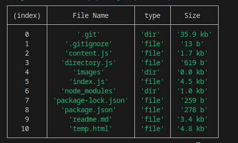
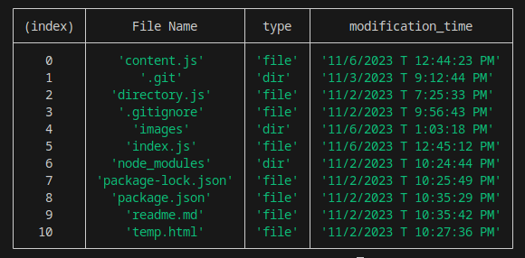
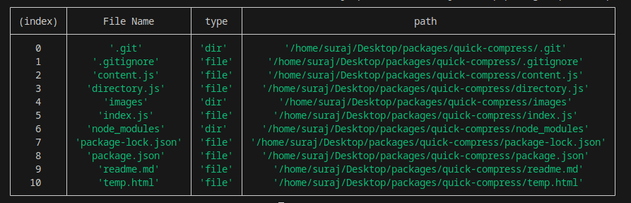
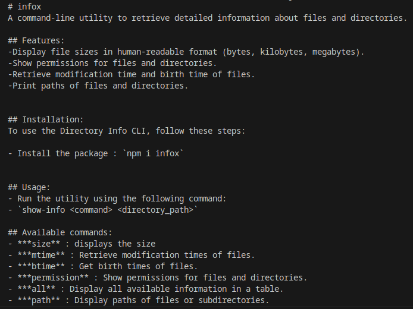

# infox
A command-line utility to retrieve detailed information about files and directories.

## Features:
-Display file sizes in human-readable format (bytes, kilobytes, megabytes).
-Show permissions for files and directories.
-Retrieve modification time and birth time of files.
-Print paths of files and directories.


## Installation:
To use the Directory Info CLI, follow these steps:

- Install the package : `npm i infox`


## Usage:
- Run the utility using the following command:
- `show-info <command> <directory_path>`

## Available commands:
- ***size** : displays the size
- ***mtime** : Retrieve modification times of files.
- ***btime** : Get birth times of files.
- ***permission** : Show permissions for files and directories.
- ***all** : Display all available information in a table.
- ***path** : Display paths of files or subdirectories.
- ***file** : details of a specific file.
- ***content** : content of a specific file.

## Examples 1:
- ***command***-
```bash
show-info size /home/suraj/Desktop/packages/quick-compress/

```

- ***output***-



## Example 2:
- ***command***-
```bash
show-info mtime /home/suraj/Desktop/packages/quick-compress/

```

- ***output***-



## Example 3:
- ***command***-
```bash
show-info path /home/suraj/Desktop/packages/quick-compress/

```

- ***output***-



## Example 4:
- ***command***-
- here we will use filepath instead of directory path for the information of a specific file.
```bash
show-info file /home/suraj/Desktop/packages/quick-compress/LICENCE.md

```

- ***output**-
```bash
    'LICENCE.md': {
    type: 'file',
    size: '1.0 kb',
    mtime: '11/6/2023 T 1:23:16 PM',
    permissions: 'rw-rw-r--',
    btime: '11/6/2023 T 1:23:10 PM',
    path: '/home/suraj/Desktop/packages/quick-compress/LICENCE.md' }

```

## Example 5:
- ***command***-
- here we will use filepath instead of directory path for the content of a specific file.
```bash
show-info content /home/suraj/Desktop/packages/quick-compress/LICENCE.md

```

- ***output***-



## Acknowledgments:

- This tool was developed to provide quick and informative insights into file and directory attributes.
- Special thanks to the Node.js community for creating and maintaining the `fs` module, which enables access to file system information.

## Feedback and Contributions

Feedback, bug reports, and contributions are welcome! Feel free to open an issue or create a pull request.

---

**Disclaimer**: This tool provides information based on the available file system metadata. Some file systems or platforms may not support all timestamps. Use this tool at your own discretion.

## Repository

The source code for this project is available on [GitHub](https://github.com/Surajchandraa/infox).

Feel free to open issues, submit pull requests, or explore the codebase.
